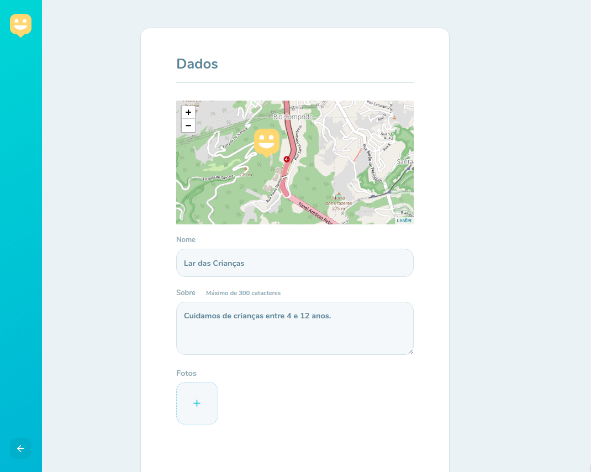
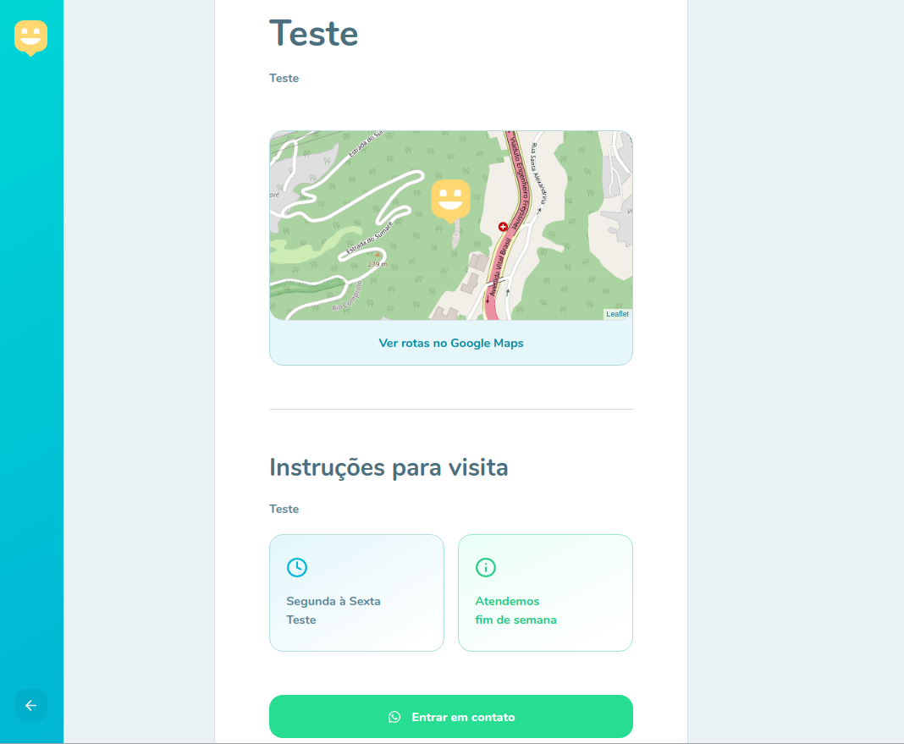
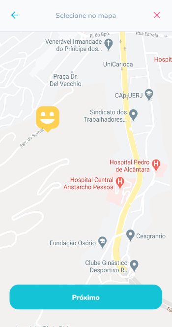
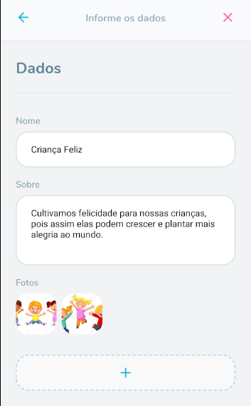
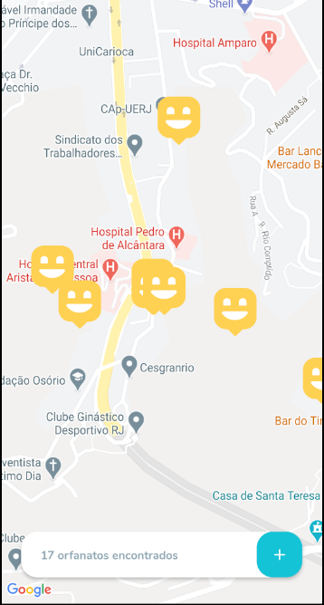

<!-- @format -->

<h1>

<p align="center">
  

  
  
  <a href="https://github.com/vitorsemidio-dev/happy-nlw3/commits/master">
    
  </a>
    
   
</p>
</h1>

## 🏁 Tópicos

<p>
    👉<a href="#-sobre-o-projeto" style="text-decoration: none; "> Sobre</a> <br/>
    👉<a href="#-desafios" style="text-decoration: none; "> Desafios</a> <br/>
    👉<a href="#-funcionalidades" style="text-decoration: none; "> Funcionalidades</a> <br/>
    👉<a href="#-layout" style="text-decoration: none"> Layout</a> <br/>
    👉<a href="#-como-executar-o-projeto" style="text-decoration: none"> Como executar</a> <br/>
    👉<a href="#-tecnologias" style="text-decoration: none"> Tecnologias</a> <br/>
    👉<a href="#-autor" style="text-decoration: none"> Autor</a> <br/>
</p>

## 💻 Sobre o projeto

Happy - é uma plataforma online para encontrar e facilitar visitas em orfanatos.

Projeto desenvolvido durante a **3º edição da NLW - Next Level Week** oferecida pela [Rocketseat](https://blog.rocketseat.com.br).

<a name="-desafios"></a>

## 😎 Desafios

Link [Notion Desafios](https://www.notion.so/Vers-o-2-0-do-Happy-c754db7a4d41469e8c2d00fcf75392c4)

- [ ] Layout da aplicação
- [ ] Acesso restrito
- [ ] Recuperação de senhas
- [ ] Cadastro de orfanatos
- [ ] Splash Screen no react Native com Expo
- [ ] Onboarding no usuário
- [ ] Localização real do usuário
- [ ] Cadastro em múltiplas etapas
- [ ] Logout da aplicação
- [ ] Deploy da aplicação

---

<a name="-funcionalidades"></a>

## ⚙️ Funcionalidades

- [x] Back-end ✔️
- [x] Front-end ✔️
- [x] Mobile ✔️

---

## 🎨 Layout

### Web

<p align="center">
    
    
    
    
</p>

### Mobile

<p align="center">
    
    
    
    
</p>

---

## 🚀 Como executar o projeto

Este projeto é divido em três partes:

1. Backend (pasta server)
2. Frontend (pasta web)
3. Mobile (pasta mobile)

> 💡 O Frontend e o Mobile precisam que o Backend esteja sendo executado para funcionar.

### 🎲 Rodando o Backend (servidor)

```bash

# Clone este repositório
$ git clone https://github.com/vitorsemidio-dev/happy-nlw3.git

# Acesse a pasta do projeto no terminal/cmd
$ cd happy-nlw3

# Vá para a pasta backend
$ cd server

# Instale as dependências com yarn
$ yarn

# Crie o banco de dados do sistema, caso não tenha
$ yarn typeorm migration:run

# Execute a aplicação
$ yarn run dev

# O servidor inciará na porta:3333 - acesse http://localhost:3333

```

### 🧭 Rodando a aplicação web (Frontend)

```bash

# Clone este repositório
$ git clone https://github.com/vitorsemidio-dev/happy-nlw3.git

# Acesse a pasta do projeto no seu terminal/cmd
$ cd happy-nlw3

# Vá para a pasta da aplicação Front End
$ cd web

# Instale as dependências
$ yarn install

# Execute a aplicação em modo de desenvolvimento
$ yarn start

# A aplicação será aberta na porta:3000 - acesse http://localhost:3000

```

### 📱 Rodando a aplicação mobile (App)

```bash

# Clone este repositório
$ git clone https://github.com/vitorsemidio-dev/happy-nlw3.git

# Acesse a pasta do projeto no seu terminal/cmd
$ cd happy-nlw3

# Vá para a pasta da aplicação Mobile
$ cd mobile

# Instale as dependências
$ yarn install

# Execute a aplicação em modo de desenvolvimento
$ yarn start

```

---

## 🛠 Tecnologias

As seguintes ferramentas foram usadas na construção do projeto:

#### **Web** ([React](https://reactjs.org/) + [TypeScript](https://www.typescriptlang.org/))

- **[React Router Dom](https://github.com/ReactTraining/react-router/tree/master/packages/react-router-dom)**
- **[React Icons](https://react-icons.github.io/react-icons/)**
- **[Leaflet](https://leafletjs.com/)**
- **[React-Leaflet](https://react-leaflet.js.org/)**
- **[Axios](https://github.com/axios/axios)**
- **[Styled Components](https://styled-components.com/)**

> Veja o arquivo [package.json](https://github.com/vitorsemidio-dev/happy-nlw3/blob/master/web/package.json)

#### **Server** ([NodeJS](https://nodejs.org/en/) + [TypeScript](https://www.typescriptlang.org/))

- **[Express](https://expressjs.com/)**
- **[CORS](https://expressjs.com/en/resources/middleware/cors.html)**
- **[TypeORM](https://typeorm.io/#/)**
- **[SQLite](https://github.com/mapbox/node-sqlite3)**
- **[Multer](https://github.com/expressjs/multer)**
- **[Yup](https://github.com/jquense/yup)**

> Veja o arquivo [package.json](https://github.com/vitorsemidio-dev/happy-nlw3/blob/master/backend/package.json)

#### **Mobile** ([React Native](https://reactnative.dev/) + [TypeScript](https://www.typescriptlang.org/))

- **[Expo](https://expo.io/)**
- **[React Native Maps](https://github.com/react-native-maps/react-native-maps)**
- **[Styled Components](https://styled-components.com/)**
- **[React Navigation](https://reactnavigation.org/)**
- **[Expo Google Fonts](https://github.com/expo/google-fonts)**

> Veja o arquivo [package.json](https://github.com/vitorsemidio-dev/happy-nlw3/blob/master/mobile/package.json)

---

<a name="-autor"></a>

## 🦸‍♂️ **Autor**

<p>
<kbd>
 
 </kbd>
 <br />
 <sub><strong>🌟 Vitor Emídio 🌟</strong></sub>
</p>

[](https://www.linkedin.com/in/vitorsemidio/)
[](https://github.com/vitorsemidio-dev)
